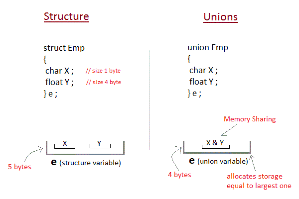

# Union

### What is Union

**Unions** are conceptually similar to **structures**. The syntax to declare/define a union is also similar to that of a structure. The only differences is in terms of storage. In **structure** each member has its own storage location, whereas all members of **union** uses a single shared memory location which is equal to the size of its largest data member.

  




### Accessing a Union Member in C

Syntax for accessing any `union` member is similar to accessing structure members,

```c
union test
{
    int a;
    float b;
    char c;
}t;

t.a;    //to access members of union t
t.b;     
t.c;
```

### Example

```c
#include <stdio.h>

union item
{
    int a;
    float b;
    char ch;
};

int main( )
{
    union item it;
    it.a = 12;
    it.b = 20.2;
    it.ch = 'z';
    
    printf("%d\n", it.a);
    printf("%f\n", it.b);
    printf("%c\n", it.ch);
    
    return 0;
}
```

